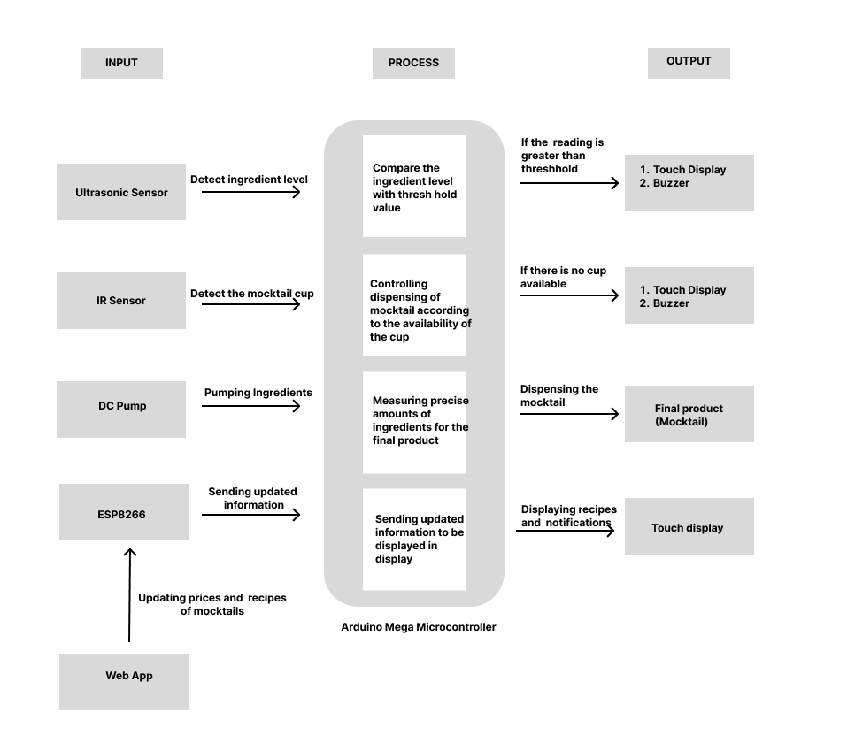
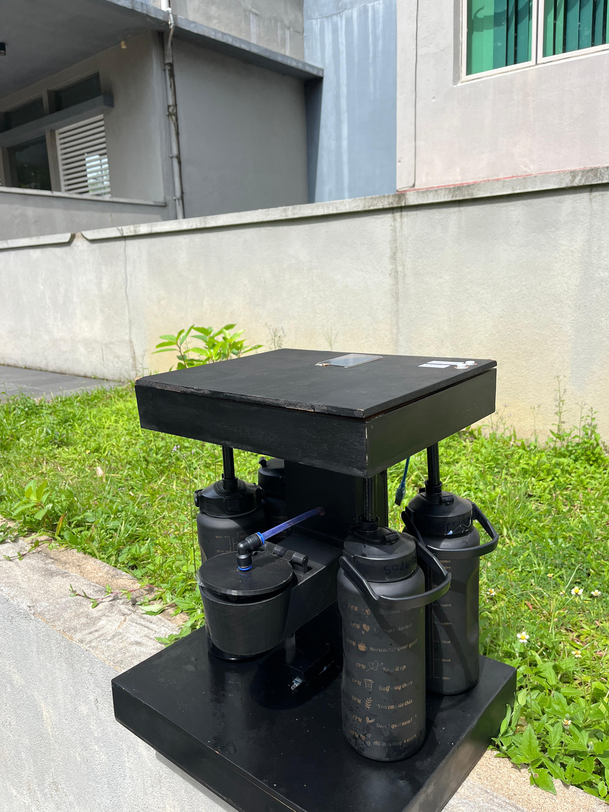
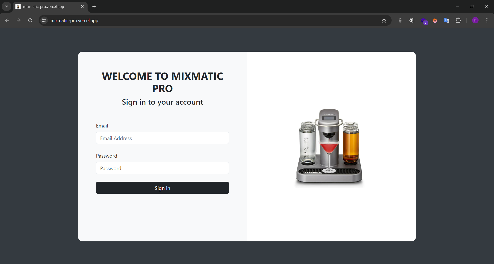
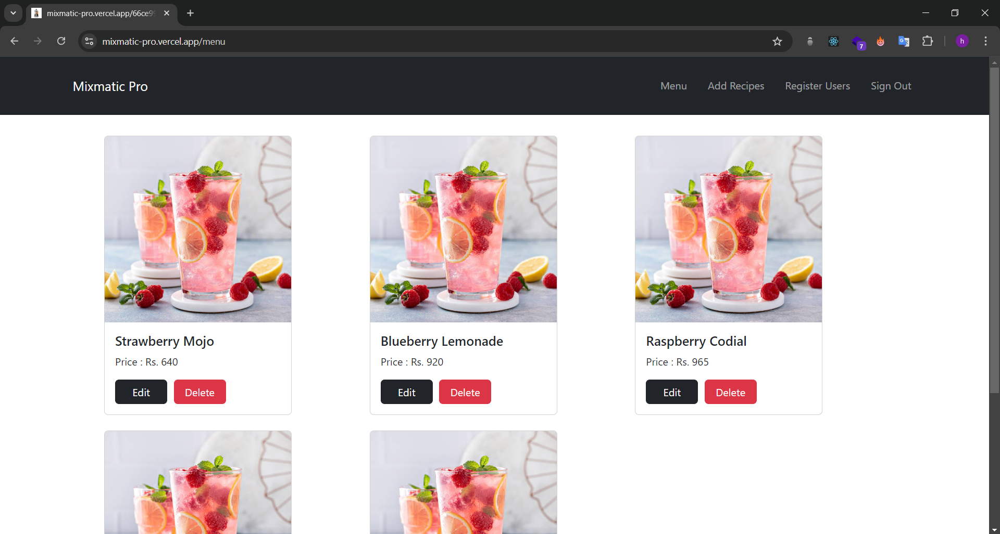

# Mix Matic Pro

Mix Matic Pro is a smart IoT device that enables users to enjoy their favorite mocktails through a seamless user experience while providing numerous advantages to the owners of the device.

## Features

- Owners can change, add, and remove recipes and their prices by logging into the web app. These changes are instantly reflected in the IoT device.
- LCD touch display provides a seamless user experience for customers choosing their favorite mocktail.
- Four ultrasonic sensors measure and inform the owner about low levels of ingredients.
- IR sensor detects whether there is a cup below the dispensing system to minimize wastage.
- A variety of recipes, sugar levels, and sodas to choose from, enhancing the user experience.

## Proposed Solution

## Exterior View

## Web App

[GitHub Repository for Web App](https://github.com/HashiruG/mixmatic-web)  
[Live Web App Link](https://mixmatic-pro.vercel.app/)  
Use the following credentials to sign in:
- **Email:** test@email.com
- **Password:** 1234

## 3D Design for Capsule Mechanism

## Team

### Team Members

- Hashiru Gunathilake
- Thanuka Perera
- Indrachapa Jayasooriya
- Chamitha Thambiliyagoda
- TRF Hafza

## Links to Testing Videos

[Link to Testing Videos](https://drive.google.com/drive/folders/1zn8m0vs69tOZ52pRzmbpd6gLpcvxKnM7?usp=sharing)
